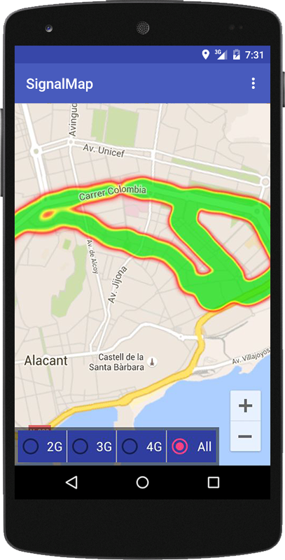

# SignalMap

Android application that shows the coverage map of your area.
This application obtains the signal strength and current location reported by OS and shows it on a map.

It has a service running always in background collecting data and saving it in a persistent data storage.
The data is displayed on a heat map, and the user is able to filter it by network technology (2G, 3G, 4G).

The app uses Google Maps Android API v2, so the device needs to run Google Play Services.

## Configuration

Change **GOOGLE_API_KEY** in the *AndroidManifest.xml*

To get a new api key go https://developers.google.com/maps/documentation/android-api/start#get-key

## License

This program is distributed under MIT license. See *LICENSE.txt* for details.